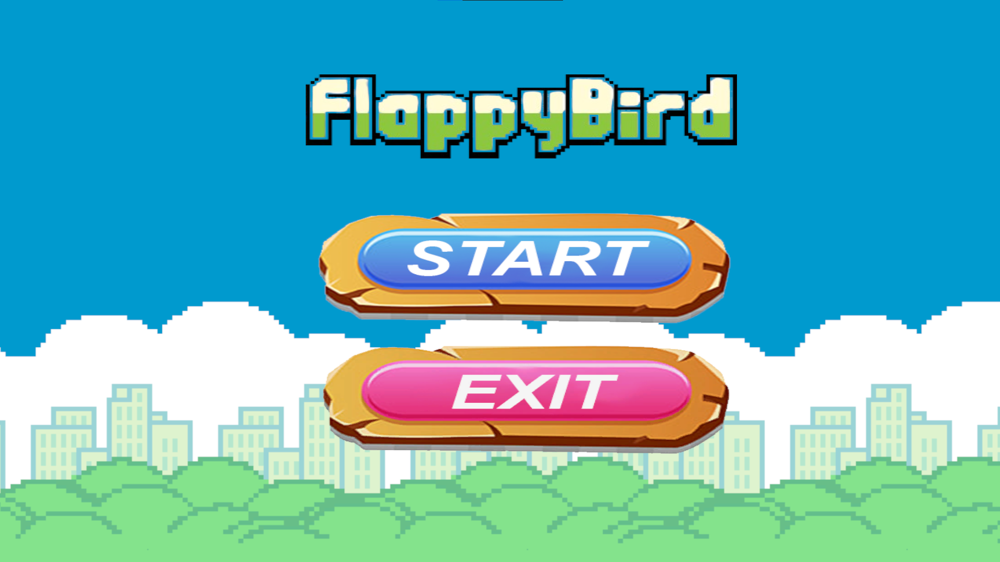
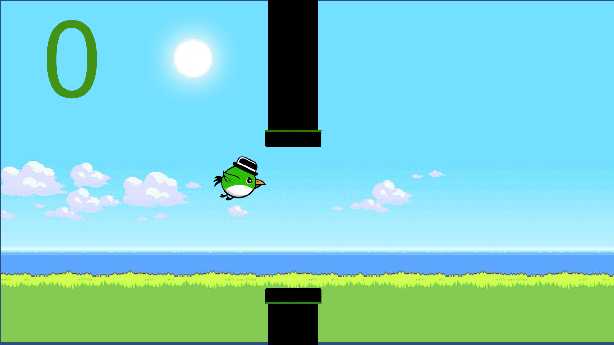
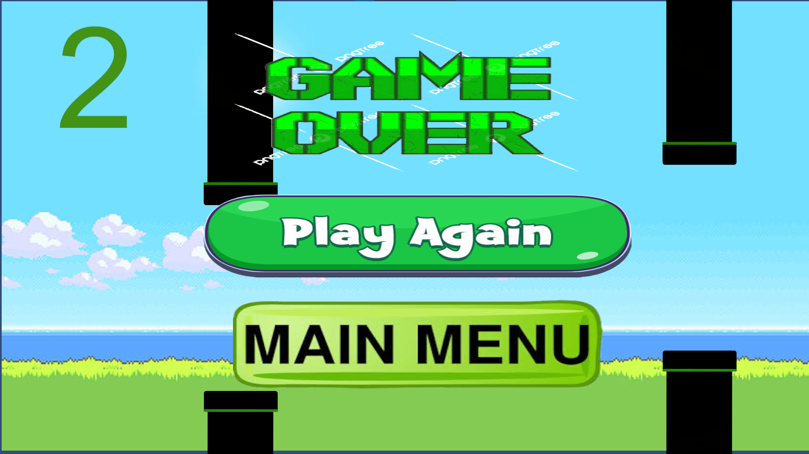

# Flappy Bird - 2D Unity Game

## Overview
**Flappy Bird** is a fun and addictive 2D game built using **Unity**! The game follows the classic mechanics of the original Flappy Bird, where you control a bird that must navigate through obstacles by pressing the **Spacebar** to flap its wings.

## Features
- 🎮 **Smooth Physics-Based Gameplay**: Uses Unity's physics engine for realistic movement.
- 🔄 **Endless Scrolling Environment**: Pipes continuously generate as you progress.
- 🏆 **Score System**: Tracks the number of pipes successfully passed.
- 💥 **Collision Detection**: The game ends when the bird collides with pipes or the ground.
- 🎵 **Background Music & Sound Effects**: Enhances the gaming experience.
- 🚀 **Optimized Performance**: Runs efficiently on different hardware.

## Project Workflow
1. **Game Design:** Planning UI, mechanics, and sprite design.
2. **Development:** Implementing player controls, collision detection, and score tracking.
3. **Testing:** Debugging physics, performance optimization, and playtesting.
4. **Deployment:** Running the game in Unity and packaging for distribution.

## Installation
### Prerequisites
Ensure you have **Unity** installed. Then, clone the repository:
```bash
git clone https://github.com/yourusername/FlappyBird.git
cd FlappyBird
```

### Running the Game
1. Open the project in Unity.
2. Press the **Play** button in the Unity editor to start the game.

## How to Play
- Press **Spacebar** to make the bird flap its wings.
- Avoid hitting the pipes and the ground.
- Score points by successfully passing through the pipes.
- The game ends when the bird collides with an obstacle.

## Technologies Used
- 🛠 **Game Engine**: Unity
- 💻 **Programming Language**: C#
- 🎨 **Graphics**: 2D Sprites
- ⚙ **Physics Engine**: Unity Rigidbody

## Screenshots & Demo
### Screenshots
#### Game Start Screen


#### Gameplay


#### Game Over Screen


### Demo Video
🎥 **Watch the demo:**
[Click here to view](flappybird_demo.mp4)

## Future Enhancements
🚧 **Planned Updates:**
- Adding different difficulty levels.
- Implementing various bird skins.
- Integrating a global leaderboard.
- Introducing power-ups and special abilities.

## Contributing
Feel free to fork the repository, make enhancements, and submit a pull request.

## Contact
📧 Email: wasifsohail66@gmail.com

## Credits
Developed by **Wasif Sohail**.

## Disclaimer
This project is for educational and personal use only.

